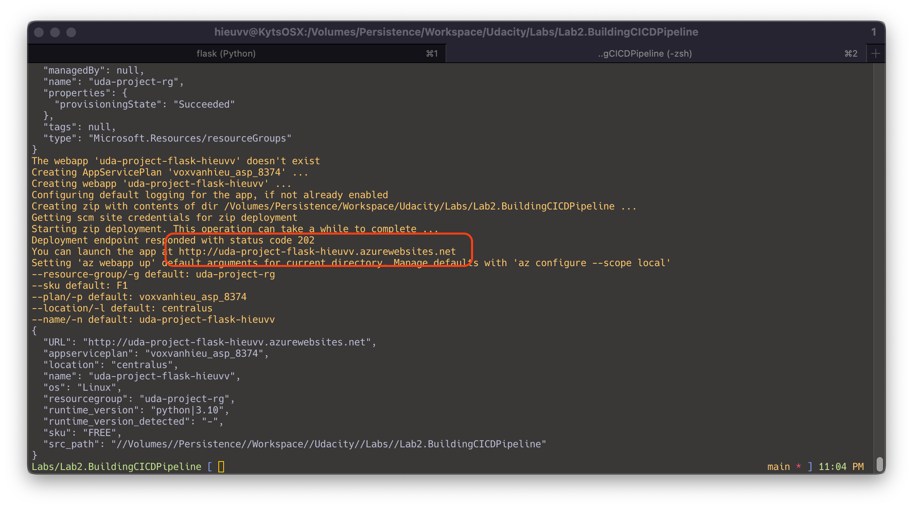
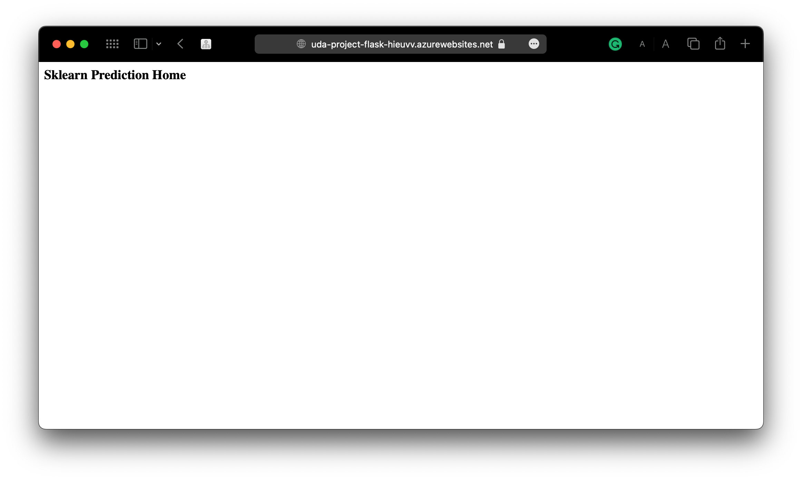
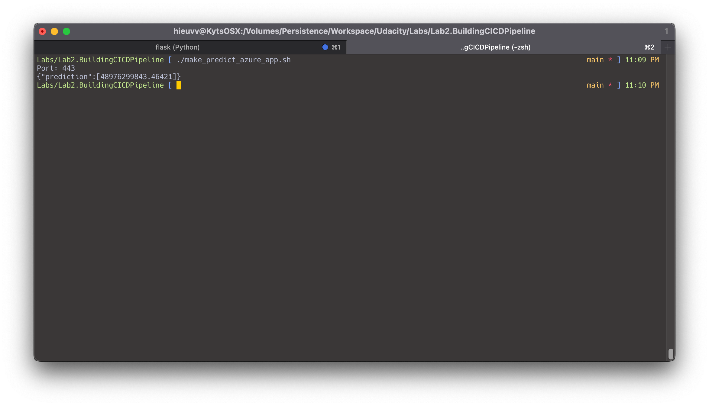
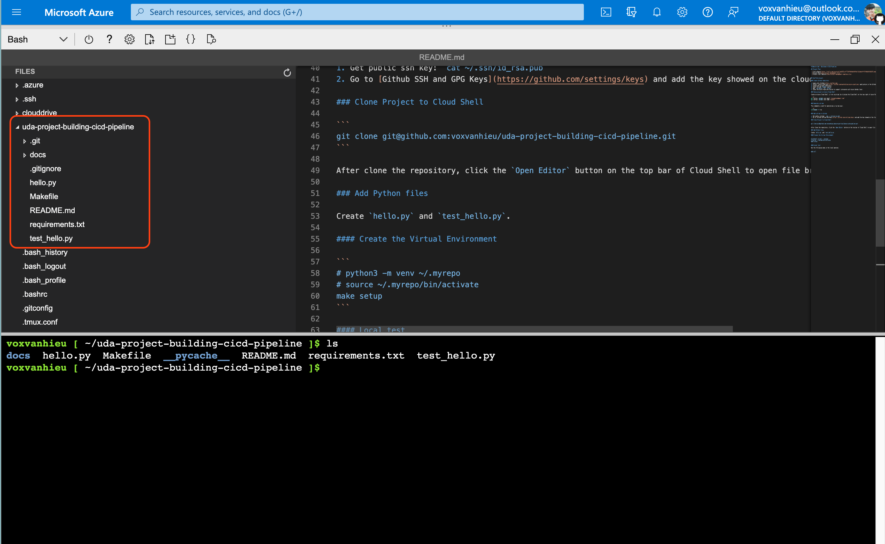
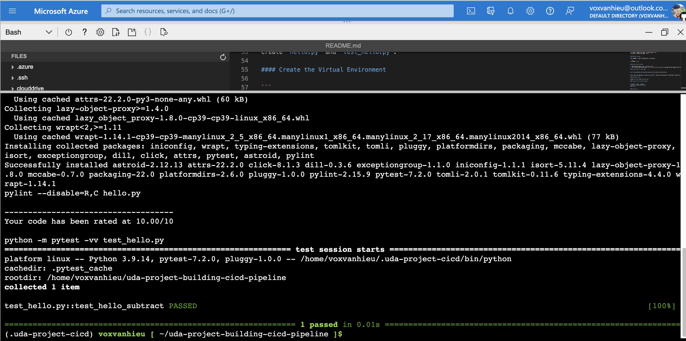
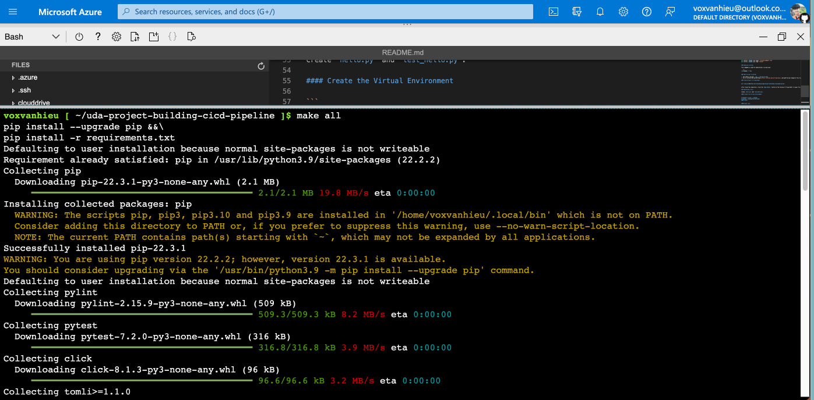
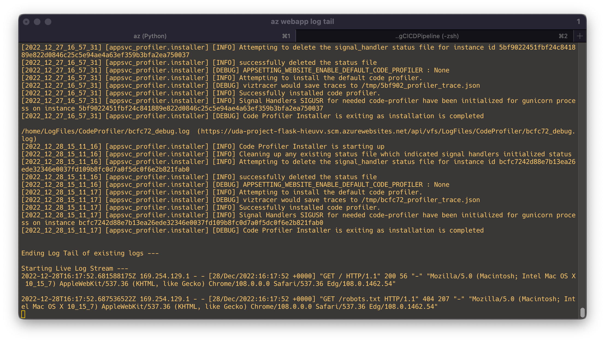

# Udacity Lab - Building A CICD Pipeline

[](https://github.com/voxvanhieu/uda-project-building-cicd-pipeline/actions/workflows/pythonapp.yml)

This project is for the Udacity Azure DevOps program submission. Including the Trello Board, Project plan for Agile workflow and the Azure CICD pipelines instruction.

## Project Plan

- [Trello Board](https://trello.com/invite/b/3umIO3Iu/ATTI5970848d340766c7101bbc0ff977d95b97A8587E/udacity-my-project-q1y22)
- [Project Plan](docs/project-management.xlsx)
- [Project Plan Template](docs/project-management-template.xlsx)

## Instructions

### How to run the Python project

#### Manually deploy project to Azure App Service

To deploy a web app to Azure Web Service, you need to have an Azure account with a subscription. Login into cli using `az login` then create new Resource Group and deploy a new webapp. If you didn't create any RG or provide in the `az webapp` command, the CLI will create automatically.

```bash
az group create -l westus -n uda-project-rg
az webapp up --sku F1 -n uda-project-flask-hieuvv -g uda-project-rg --runtime "PYTHON:3.10.9"
```





Modify the `<yourappname>` in the `make_predict_azure_app.sh` then execute it in terminal to see the result.



[Home Page](https://uda-project-flask-hieuvv.azurewebsites.net)

[Log](https://uda-project-flask-hieuvv.scm.azurewebsites.net/api/logs/docker)

```bash
az webapp log tail
```

#### Create Github repository

1. Login into [Github](https://github.com).
2. Install [Azure Pipelines](https://github.com/marketplace/azure-pipelines) application in the Github marketplace.
3. Create new private repository.
4. Check the add `Readme` button.
5. Add `.gitignore` for `Python`.
6. Check the Azure Pipelines button to support intergrate with Azure DevOps later.

#### Setup project on Azure Cloud Shell

Create an Azure Cloud Shell (if not existing) by clicking the Cloud Shell on the top-right of Azure Portal. Then setup the git information:

```sh
git config --global user.email "YOUR EMAIL"
git config --global user.name "YOUR NAME"
```

#### Generate ssh key

This command is used for generating a rsa key pair.

```sh
ssh-keygen -t rsa
```

#### Add ssh key to Github

1. Get public ssh key: `cat ~/.ssh/id_rsa.pub`
2. Go to [Github SSH and GPG Keys](https://github.com/settings/keys) and add the key showed on the cloud shell.

#### Clone Project to Cloud Shell

```
git clone git@github.com:voxvanhieu/uda-project-building-cicd-pipeline.git
```

After clone the repository, click the `Open Editor` button on the top bar of Cloud Shell to open file browser and editor.



#### Create the Virtual Environment

```
make setup
# python3 -m venv ~/.myrepo
# source ~/.myrepo/bin/activate
```

#### Local test

Run the following code in the local machine.

```
make all
```








## Enhancements

This project is just a prototype for Udacity course's lab. So, it's need to be improved:

- Auto send CI/CD status message in to chat chanel (Discord, Telegram, etc.)
- Add more test case / scenarios
- CD the branch to a specified environment (dev, test, staging, prod, etc.)

## Demo 

<iframe width="560" height="315" src="https://www.youtube.com/embed/Lp54Sc-jn5A" title="YouTube video player" frameborder="0" allow="accelerometer; autoplay; clipboard-write; encrypted-media; gyroscope; picture-in-picture" allowfullscreen></iframe>
